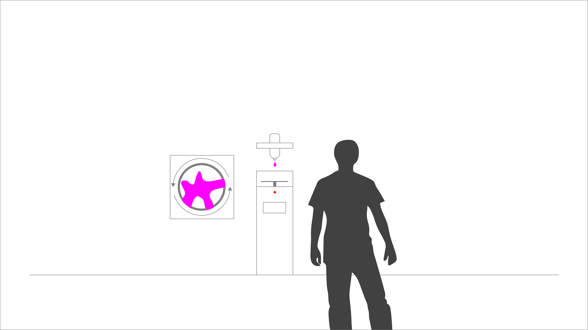
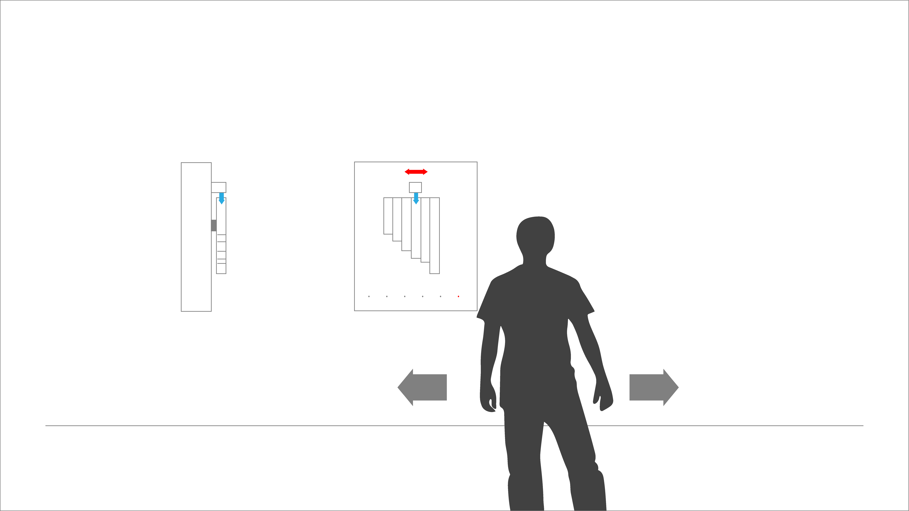

README  
======

> “It's not how much we give but how much love we put into giving.”   
> [Mother Teresa](https://en.wikipedia.org/wiki/Mother_Teresa)

## Abstract motor poster  

With this documentation I would like to present the results of our last project developed during the summer term at FHP tutored by Fabian Morón Zirfas: 11EG-B Elementares Gestalten - Basics 1.012 Grundlagen Fläche und Struktur Werkstattpraxis. [Link website](https://incom.org/workspace/5859)

## Prerequisite  

For the last project in this term our teacher briefed us with a short presentation and introduced us to the basic ideas:

- Find electrical scrap and hack it.

- Tell a story, a joke or make a statement on a moved, electrical poster

- Translate the human computer interaction (HCI) technically.

- Find a way to hide the electronic components and devices that drives the motor poster.

- The viewer should activate the motor poster passively. No touching, no obvious buttons.      

So I started to buy electronic scrap from my junk dealer around the corner while I sketched up my first motor poster ideas.

#### The cloaking device

The cloaking devices is an optical trick. When looking through a group of magnifying glasses, objects placed between them, will partly disappear by bending the light. When the viewer approaches to the device the up and down moving magnifying glasses would stop on the same height. [Link University of Rochester ](http://www.rochester.edu/newscenter/watch-rochester-cloak-uses-ordinary-lenses-to-hide-objects-across-continuous-range-of-angles-70592/ )  

#### The painter plate

The next idea was a device that constantly drips paint on a rotating paper. The closer the viewer approaches, the faster the plate rotates.

#### The chladni plate

The chladni device is a sand covered metal plate that makes frequencies visible through vibration. Depending on the frequency range, the sands starts to create certain pattern. The closer the viewer approaches, the higher the frequency.       

#### The led mirror

The viewers silhouette and movement will be mirrored by a led matrix.   

#### Etch a sketch

The sketch device will follow the viewers movement (left, right, far and near) and etch it on a board.

#### The pan flute

The last idea was a pan flute that either plays certain tones depending on the viewers position or plays a melodie after the viewer left the device.    

After a short presentation it turns out that the pan flute device was the one I should work on. Next we had to create a paper dummy video.

_Password: Pan_

The main problem was to generate enough air pressure to play the flute. So looking up for a generator or compressor was the first step I had to take. This turned out to be the most problematic part. I couldn´t find a generator that had enough power and at the same time runs almost silently. I bought compressed air, a 12V mini compressor and was about to order a lego pneumatic generator providing about three bar air pressure, when I decided to reconsider my motor poster idea.

After searching the web for new ideas I end up on this page by accident: [www.007james.com](http://www.007james.com/gadgets/aston_martin_db5.php). I was fascinated by Bonds license flip plate Q installed in his Aston Martin and decided to work with it. So I came up with the idea of a flip board device that tempts the viewer to grab at something, e.g money or sweets, lying on a board. At the moment, when the viewer is about to grab, the board flips and unveils a coin slot and a text, with a demand for donation saying: "Giving feels better than receiving."

I started to make first prototype and looked up for fitting components to buy.

- I needed a stepper motor and a driver to rotate the board.
- A fitting case made of MDF.
- A Sensor that recognizes the viewers movement.

#### First Prototypes

At the beginning I wanted to create a single case just like the paper dummy shows above. Later on I came to the conclusion that attaching the stepper motor externally is much easier.

#### Final impressions and flip board video

_The final flip board in action. Password: Flip_

## Dependencies  

The main hardware we had to use was the Arduino board. A micro controller that is able to drive small stepper motors, led´s and other electronic components.

Finding the right driver for my stepper motor was the first problem. So I started experimenting with the H-Bridge driver, but unfortunately the device got extremely hot. Therefore I switched over to the Schmalzhaus driver. An well documented, convenient and easy to use device. [Schmalzhaus Easydriver documentation](http://www.schmalzhaus.com/EasyDriver/)

#### The Fritzing sketch   

This is the final switching circuit that drives the flip board.
   

#### The arduino code

The Ardunio code you will need to run all components.

    #define BUTTONPIN 4   //defining first contactbutton on pin four
    #define BUTTONPIN2 5  //defining second contactbutton on pin five
    int counter = 0;      
    int smDirectionPin = 2;   //Direction pin
    int smStepPin = 3;       //Stepper pin
    int smEnablePin = 7;     //Motor enable pin
    int smSleepPin = 8;      //Sleepin on pin 8
    const int irPin = 1;     //analog input for distance senosr
    float distance = 100;    //set up initial distance

    boolean inaction = false;

    boolean waiting_for_input = true;
    void setup() {
    /*Sets all pin to output; the microcontroller will send them(the pins) bits, it will not expect to receive any bits from thiese pins.*/
    pinMode(BUTTONPIN, INPUT_PULLUP);   // declare buttonpin as input
    pinMode(smDirectionPin, OUTPUT);    // declare direction pin as output
    pinMode(smStepPin, OUTPUT);         // declare step pin as output
    pinMode(smEnablePin, OUTPUT);       // declare enable pin as output
    pinMode(smSleepPin, OUTPUT);        // declare sleep pin as output
    pinMode(irPin, INPUT);              // declare infrared sensor as input

    digitalWrite(smSleepPin, HIGH);     //Disables sleep pin
    digitalWrite(smEnablePin, HIGH);     //Disbales the motor, so it can rest untill it is called uppond

    Serial.begin(9600);
    }

    void loop() {

    if (waiting_for_input == true) {
    distance = 4800 * pow(analogRead(irPin), -0.935) - 11; //defining the distance in cm. attention! depending on sensor model
    }
    Serial.println(distance);                                //prints distance in console

    /*Here we are calling the rotate function to turn the stepper motor*/

    if (distance <= 10) {                      //check if the input is HIGH
    waiting_for_input = false;              
    rotate(840, 0.11);                      //half rotation plus    
    delay(45000);
    while ((digitalRead(BUTTONPIN) == HIGH)) { //rotates until contact
      rotate(-8, 0.11);                        
    } // close while dRead BP
    if (digitalRead(BUTTONPIN) == LOW) {
      waiting_for_input = true;
    } // end of if dRead BP == LOW
    } // end if if distance
    } // end of loop

    /*The rotate function turns the stepper motor. Tt accepts two arguments: 'steps' and 'speed'*/
    void rotate(int steps, float speed) {
    digitalWrite(smSleepPin, HIGH); // Disables sleep pin
    digitalWrite(smEnablePin, LOW); //Enabling the motor, so it will move when asked to

    /*This section looks at the 'steps' argument and stores 'HIGH' in the 'direction' variable if */
    /*'steps' contains a positive number and 'LOW' if it contains a negative.*/
    int direction;

    if (steps > 0) {
    direction = HIGH;
    } else {
    direction = LOW;
    }

    speed = 1 / speed * 70;   //Calculating speed
    steps = abs(steps);       //Stores the absolute value of the content in 'steps' back into the 'steps' variable

    digitalWrite(smDirectionPin, direction); //Writes the direction (from our if statement above), to the EasyDriver DIR pin

    /*Steppin'*/
    for (int i = 0; i < steps; i++) {
    digitalWrite(smStepPin, HIGH);
    delayMicroseconds(speed);
    digitalWrite(smStepPin, LOW);
    delayMicroseconds(speed);
    }
    digitalWrite(smEnablePin, HIGH);   //Disbales the motor, so it can rest untill the next time it is called uppond
    digitalWrite(smSleepPin, LOW);      //Enables sleep pin
    }
## Installation  

Clone the repository on your Desktop or download the source code on your hard drive.  

[Get the code](https://github.com/back280/IO-SoSe-2015-flip-board/tree/master/code/sketch_jul05a_schmalzhaus_sensor_sleeppin)

## Usage  

Just open Ardunio and load the script on your board.   
## Realted Works  

Here are my latest projects.

- [Slime mold project](https://github.com/back280/IO-SoSe-2015-fox-moulder)
- [Algorythm project](https://github.com/back280/IO-SoSe-2015-algorithm)  

## Thanks  

I want to thank Fabian Morón Zirfas for all the support.

## License  

    DO WHAT THE FUCK YOU WANT TO PUBLIC LICENSE
    Version 2, December 2004

    Copyright (C) 2015 Paul Roemer

    Everyone is permitted to copy and distribute verbatim or modified
    copies of this license document, and changing it is allowed as long
    as the name is changed.

    DO WHAT THE FUCK YOU WANT TO PUBLIC LICENSE
    TERMS AND CONDITIONS FOR COPYING, DISTRIBUTION AND MODIFICATION

    0. You just DO WHAT THE FUCK YOU WANT TO.
