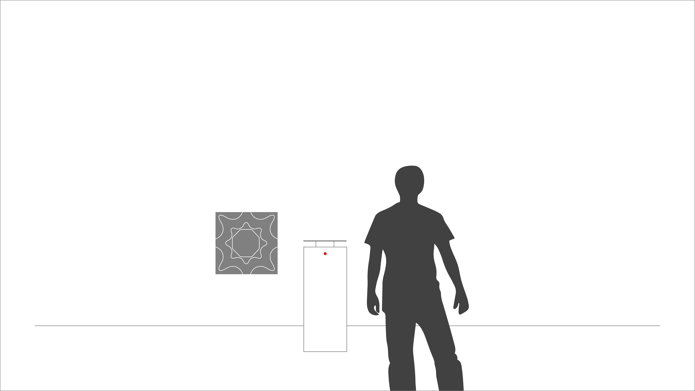
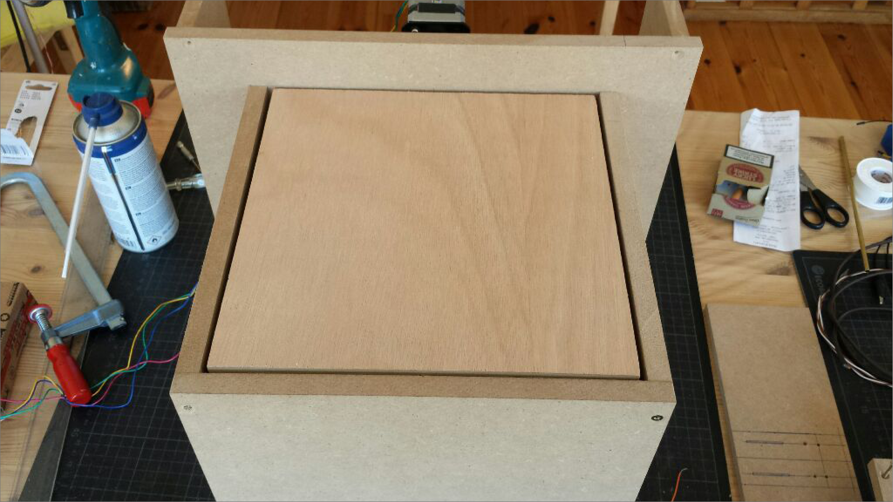

README  
======

> “It's not how much we give but how much love we put into giving.”   
> [Mother Teresa](https://en.wikipedia.org/wiki/Mother_Teresa)

##Abstract motor poster:  

With this documentation I would like to present the results of our last project developed during the summer term at FHP tutored by Fabian Morón Zirfas: 11EG-B Elementares Gestalten - Basics 1.012 Grundlagen Fläche und Struktur
Werkstattpraxis.

##Prerequisite  

For the last project in this term our teacher briefed us with a short presentation and introduced us to the basic ideas:

- Find electrical scrap and hack it.

- Tell a story, a joke or make a statement on a moved, electrical poster

- Translate the human computer interaction (HCI) technically.

- Find a way to hide the electronic components/devices that drives the motor poster.

- The viewer should activate the motor poster passively. No touch, no obvious buttons.      

So is started to buy electronic scrap from my junk dealer around the corner while I sketched up my first motor poster ideas:

###The cloaking device

The cloaking devices is an optical trick. When looking through a group of magnifying glasses, objects placed between them, will partly disappear. When the viewer approaches to the device the magnifying glasses stop on the same height. [University of Rochester ](http://www.rochester.edu/newscenter/watch-rochester-cloak-uses-ordinary-lenses-to-hide-objects-across-continuous-range-of-angles-70592/ )  

###The painter plate

The next idea was a device that constantly drips paint on a rotating paper. The closer the viewer approaches, the faster the plate rotates.

###The chladni plate

The chladni device is a sand covered metal plate that makes frequencies visible through vibration. Depending on the frequency response, the sands starts to create certain pattern. The closer the viewer approaches, the higher the frequency.       

###The led mirror

The viewers silhouette and movement will be mirrored by a led matrix.   

###Etch a sketch

The sketch device will follow the viewers movement (left, right, far, near) and etch it on a board.

###The pan flute

The last idea was a pan flute that either plays certain tones depending on the viewers position or plays a melodie after the viewer left the device.    

After a short presentation it turns out that the pan flute device was the one I should work on. Next we had to create a paper dummy video.

_Password: Pan_

The main problem was to generate enough air pressure to play the flute. So looking up for a generator or compressor was the first step I had to take. This turned out to be the most problematic part. I couldn´t find a generator that had enough power and at the same time runs silently/noiseless. I bought compressed air in a bottle, a 12V mini compressor and was about to order a lego pneumatic generator that runs with 12V batteries and provides about three bar air pressure, when I decided to reconsider my motor poster idea.

After searching the web for new ideas I end up on this page by accident: [www.007james.com](http://www.007james.com/gadgets/aston_martin_db5.php). I was fascinated by Bonds license flip plate Q installed in his Aston Martin and decided to work with it. So I came up with the idea of a (flip board) device that tempts the viewer to grab at something, e.g money or sweets, lying on a board. At the moment, when the viewer is about to grab, the board flips and unveils a coin slot and a text, with a request/demand for donation says: "Giving feels better than receiving."

I started to make first prototype and looked up for fitting components to buy.

- I needed a stepper motor and a driver to rotate the board.
- A fitting case made of MDF.
- A Sensor that recognizes the viewers movement.

At the beginning I wanted to create a single case just like the paper dummy shows above. Later on I came to the conclusion that attaching the stepper motor externally is much easier.      

##Dependencies  

The main hardware we had to use was the Arduino board. A micro controller that is able to drive small stepper motors, led´s and other electronic components.

The Main problem was to find a right driver for my stepper motor. So I started experimenting with the H-Bridge driver, but unfortunately the device got extremely hot. So I switched over to the Schmalzhaus driver. An well documented, convenient and easy to use device. [Schmalzhaus Easydriver](http://www.schmalzhaus.com/EasyDriver/)

Here is the Arduino sketch:  

- Flip board Code
- flip board video usage

In the dependencies section you can tell the reader what your project relies on. e.g if you are using Python you could write which modules. Or on the Raspberry Pi it would be the packages. Below you see an ordered list.  

1. Ordered list  
2. more things  

##Installation  

Here you tell what should be done to install your project. You could tell him to clone it with git and run some install script or just provide all the code to install all packages on a Raspberry Pi. This should be done in a code block if it is code. You can write code inline by enclosing it in ticks \` ` like this` or you can use 4 whitespaces like in the example below.  

    git clone https://github.com/fabiantheblind/README.git
    cd README

Or for example:  

    sudo apt-get update && sudo apt-get install python-dev python-rpi.gpio

##Usage  

Now here you actually explain how to use your project. This could be some code or maybe just omething like hit "Run" in processing.  

##Realted Works  

List some related works an inspiration if you have some.  

- [Very interesting](http://example.com)  

##Thanks  

Give thanks to those whe deserve it.  

##License  

And don't forget the license!

                DO WHAT THE FUCK YOU WANT TO PUBLIC LICENSE
                    Version 2, December 2004
    Copyright (C) 2015 Fabian Morón Zirfas aka fabiantheblind
    Everyone is permitted to copy and distribute verbatim or modified
    copies of this license document, and changing it is allowed as long
    as the name is changed.
            DO WHAT THE FUCK YOU WANT TO PUBLIC LICENSE
    TERMS AND CONDITIONS FOR COPYING, DISTRIBUTION AND MODIFICATION
    0. You just DO WHAT THE FUCK YOU WANT TO.
